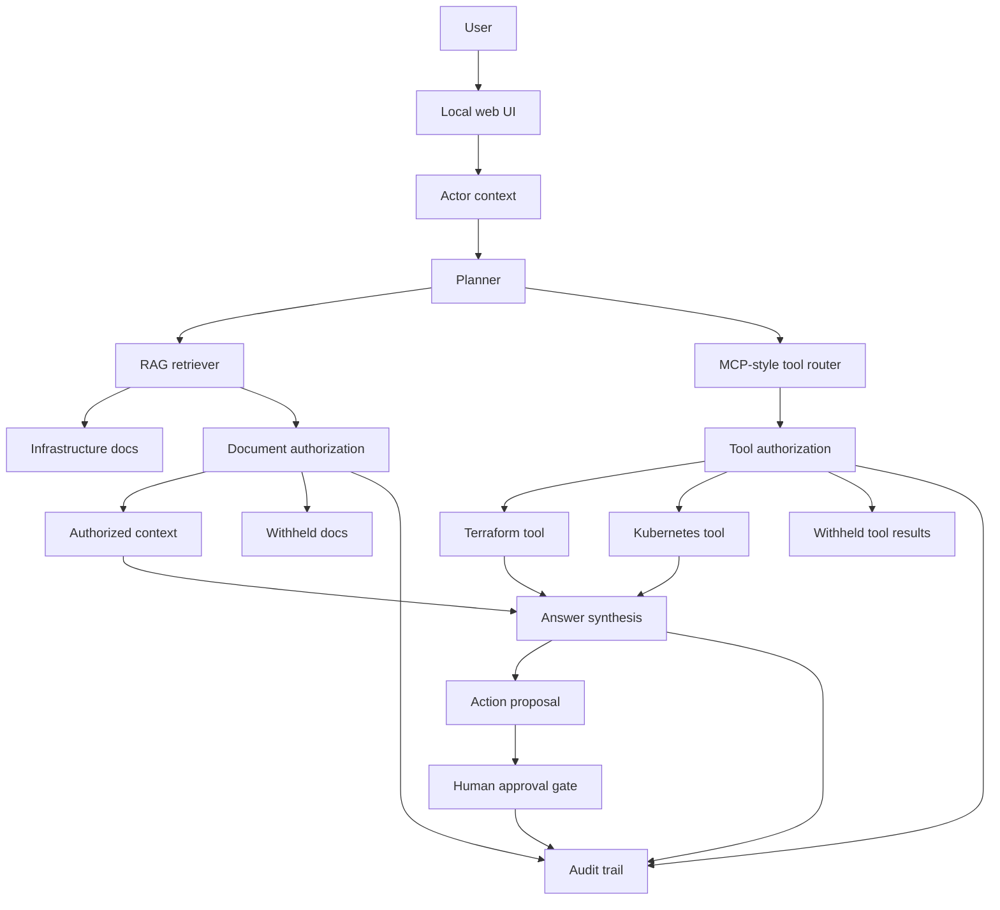

# Reference Architecture For AI-Assisted Infrastructure Operations

Permission-aware RAG, MCP-style tool access, Terraform plan review, agent workflows, approval gates, and auditability for platform teams.

This project explores what trustworthy AI-assisted infrastructure operations could look like. It is intentionally small, local, and easy to inspect. The goal is not to show off every AI framework. The goal is to show how AI-assisted infrastructure workflows behave as production systems with context boundaries, tool permissions, action gates, and auditability.

## Demo

Open the demo locally:

`demo/index.html`

No install step is required.

## Optional CLI Experiments

The static demo is the fastest walkthrough. The repo also includes optional Node.js scripts for testing permission-aware retrieval outside the browser.

If you are not a Node.js developer, start with:

`docs/local-validation-runbook.md`

The local repo folder is:

`work/authzed-ai-infra-copilot`

```bash
npm run embeddings:build
npm run rag:query -- alice "What do we know about the production outage?"
npm run rag:query -- bob "What do we know about the production outage?"
npm run authz:check -- alice document:postmortem-platform-204 read --provider=local
npm run tool:call -- alice terraform.get_recent_changes --provider=local
npm run terraform:review
npm run agent:run -- alice "Should we apply the Terraform change?" --provider=local
npm run authz:validate
```

If `OPENAI_API_KEY` is set, `embeddings:build` uses the OpenAI embeddings API. Without it, the script uses a deterministic local embedding fallback so the project remains runnable without secrets.

## Why This Exists

Most AI demos stop at chat.

Infrastructure teams need something different. A useful platform assistant needs to answer questions from trusted internal context, inspect operational systems, reason about risk, and propose actions without silently bypassing the controls teams already depend on.

This demo explores one core idea:

> Once an AI assistant can retrieve internal context and call operational tools, authorization becomes part of the product architecture.

For the broader positioning, see:

`docs/reference-architecture-positioning.md`

## What It Demonstrates

- Permission-aware RAG over infrastructure documents.
- MCP-style Terraform and Kubernetes tool calls.
- Authorization before document context reaches the model.
- Authorization before tool results are exposed.
- A distinction between answering, proposing, and acting.
- Human approval before production-impacting actions.
- Audit logs across retrieval, tool use, proposal, and approval.
- A deterministic agent workflow that plans, retrieves context, calls tools, proposes actions, and emits an audit trail.

## Implementation Tracks

This repo now has two layers:

1. A local browser demo in `demo/index.html`.
2. Production-shaped integration scaffolding for the next real implementation pass.

The integration scaffolding includes:

- `data/`: source docs, users, and tool definitions.
- `src/`: optional embedding and permission-aware retrieval scripts.
- `spicedb/`: SpiceDB/AuthZed schema and relationship model.
- `mcp/`: official Terraform MCP Server example config.
- `docs/terraform-mcp-integration.md`: Terraform MCP integration plan.
- `docs/oidc-authentication-plan.md`: real authentication plan.
- `docs/production-milestones.md`: honest roadmap from demo to production-shaped system.

## SpiceDB / AuthZed Path

The project includes an executable SpiceDB integration path for authorization checks.

Start SpiceDB:

```bash
docker compose up -d spicedb
```

Load the schema and relationships:

```bash
npm run authz:validate
npm run authz:load
```

Check document access:

```bash
npm run authz:check -- alice document:postmortem-platform-204 read --provider=spicedb
npm run authz:check -- bob document:postmortem-platform-204 read --provider=spicedb
```

Use SpiceDB during RAG filtering:

```bash
npm run rag:query -- alice "What do we know about the production outage?" --provider=spicedb
```

This is the most important production-shaped part of the project: retrieved context can be filtered by relationship-based authorization before it reaches the model.

## Terraform MCP Gateway Path

The repo includes a read-only gateway command that authorizes MCP-style tool calls before returning infrastructure data:

```bash
npm run tool:call -- alice terraform.get_recent_changes --provider=local
npm run tool:call -- bob terraform.get_recent_changes --provider=local
```

With SpiceDB running and loaded:

```bash
npm run tool:call -- alice terraform.get_recent_changes --provider=spicedb
```

The official Terraform MCP Server config lives at:

`mcp/terraform-mcp.example.json`

The intended production shape is:

1. Actor asks for Terraform context.
2. Gateway checks whether the actor can call the requested tool.
3. Allowed read-only calls are routed to Terraform MCP.
4. Plans remain proposal-only.
5. Applies remain behind human approval and controlled workflow handoff.

## Terraform Plan Review

To tie the demo back to platform engineering work, the repo includes a small Terraform plan reviewer:

```bash
npm run terraform:review
```

The real Terraform sample lives in:

`terraform/prod-network`

The reviewer inspects `data/terraform-plan.prod-network.json`, which represents a risky proposed change against that Terraform shape, and flags:

- Public security group ingress.
- Wildcard IAM permissions.
- Monitoring deletion.

The point is not to replace policy-as-code. The point is to show how an AI-native workflow can explain infrastructure risk, require authorization to inspect production plans, and keep apply behind human approval.

See:

`docs/terraform-plan-review.md`

## Agent Workflow

The repo includes a small deterministic agent runner:

```bash
npm run agent:run -- alice "Should we apply the Terraform change?" --provider=local
```

With SpiceDB running:

```bash
npm run agent:run -- alice "Should we apply the Terraform change?" --provider=spicedb
npm run agent:run -- bob "Should we apply the Terraform change?" --provider=spicedb
```

It demonstrates planning, permission-aware retrieval, authorized tool calls, Terraform risk review, action proposal, approval boundary, and audit output.

See:

`docs/agent-workflow.md`

## Terraform AI Learning Roadmap

This repo is also a way to explore AI-assisted Terraform workflows without treating agents as production operators.

See:

`docs/terraform-ai-learning-roadmap.md`

## Product Scenario

A platform engineer asks:

> Check whether the payments service is healthy and whether there were recent Terraform changes.

The workflow:

1. Identifies the actor.
2. Retrieves only documents the actor can access.
3. Calls allowed Terraform and Kubernetes tools.
4. Withholds unauthorized docs and tool results.
5. Produces an answer from authorized context.
6. Logs every decision.

If the user asks:

> Apply the rollback to production.

The workflow does not execute directly. It creates a rollback proposal and requires approval from a user with the right permission.

## Demo Personas

| User | Role | Access |
| --- | --- | --- |
| Alice | Platform engineer | Platform docs, production docs, Terraform read, Kubernetes read, rollback planning |
| Bob | Support engineer | Public docs, support docs, customer impact docs, limited service status |
| Casey | Contractor | Public docs only |
| Dana | Platform lead | Alice's access plus remediation approval |

## Suggested Walkthrough

1. Select Alice.
2. Run: `Check whether the payments service is healthy and whether there were recent Terraform changes.`
3. Notice that Alice can see production docs and infrastructure tool results.
4. Switch to Bob and run the same prompt.
5. Notice that Bob sees support/customer context but not privileged Terraform data.
6. Switch to Casey and run the same prompt.
7. Notice that Casey receives only public context.
8. Select Alice and run: `Create a rollback proposal for the last Terraform change.`
9. Switch to Dana and approve the proposal.
10. Review the audit trail.

## Architecture



## Why MCP

MCP is useful because AI assistants increasingly need access to external systems, not just static prompts. In this demo, MCP-style tools expose infrastructure capabilities such as Terraform change inspection and Kubernetes service status.

The important design point is that MCP makes tool access explicit, but it does not make tool access automatically safe. The application still needs domain-level authorization around which actor can call which tool, against which resource, under which conditions.

## Why RAG

Infrastructure answers depend on local, changing, organization-specific knowledge: runbooks, postmortems, Terraform procedures, customer impact notes, and service ownership data.

RAG grounds the assistant in that knowledge. But retrieval is also a security boundary. If unauthorized context is retrieved and sent to the model, the system has already leaked information.

This demo treats retrieved documents as protected resources.

## Why Approval Gates

Production infrastructure workflows often need plans, reviews, approvals, and audit trails. The assistant can inspect and propose, but it should not directly mutate production just because a prompt asked it to.

The demo intentionally stops at approval recording. In a production version, approval would hand off to a controlled deployment or incident remediation workflow.

## Security Model

Protected resources:

- Documentation chunks.
- Terraform workspace data.
- Kubernetes service status.
- Rollback proposals.
- Approval authority.

Policy principles:

- Filter context before model exposure.
- Check tools before execution.
- Log denied docs and tools without exposing their contents.
- Require human approval for production-impacting actions.
- Make the final answer explain what was used and what was withheld.

## What Would Change In Production

This demo uses local data and a simple in-browser permission map to keep the workflow understandable.

In production, I would add:

- Real authentication through OIDC.
- SpiceDB/AuthZed for relationship-based authorization.
- Real MCP servers, starting with read-only Terraform and Kubernetes integrations.
- Vector or hybrid retrieval with chunk-level permissions.
- Persistent audit storage.
- OpenTelemetry traces for retrieval, tool calls, authorization decisions, and approvals.
- Red-team prompts and evals for prompt injection, data leakage, and unsafe tool use.
- Memory with retention, deletion, and authorization controls.

## What Is Intentionally Not Implemented

The project does not directly mutate production infrastructure.

That is intentional. The product stance is that an agent can inspect, explain, and propose, but production-impacting actions should hand off to a controlled workflow with explicit approval and auditability.

## Current Status

This is still an exploration, not a production service. But it includes concrete paths for the gaps an infrastructure team would naturally ask about:

- Real embeddings: `src/build-embeddings.mjs`
- SpiceDB/AuthZed: `spicedb/schema.zed`
- Terraform MCP: `mcp/terraform-mcp.example.json`
- OIDC: `docs/oidc-authentication-plan.md`
- Production roadmap: `docs/production-milestones.md`

## Core Takeaway

AI-assisted infrastructure workflows are not just model problems. They are also authorization, context, tool-use, governance, and operational trust problems.
