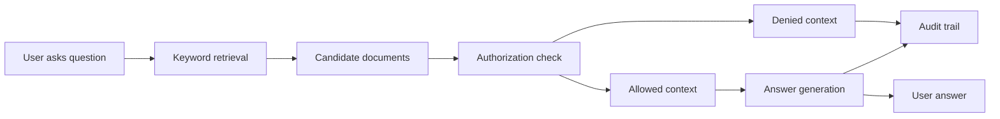

# Secure RAG Authorization Demo

This is a small, local demo for explaining why authorization has to happen before RAG context reaches the model.

Open `secure-rag-demo.html` in a browser. No install step is required.

## Demo Narrative

The key message:

> The RAG system should not retrieve everything and hope the model behaves. Authorization must filter context before the model sees it.

The demo has three users:

- Alice, a platform engineer with access to platform and production docs.
- Bob, a support engineer with access to support and customer docs.
- Casey, a contractor with access only to public docs.

Ask the same question as each user:

- `What do we know about the production outage?`
- `How do I rotate database credentials?`
- `What customer systems were affected?`
- `Should we roll back the Terraform change?`

The retrieval candidates are scored first, then each candidate is checked against the user's permissions. Denied documents are shown in the UI as withheld from model context.

## Architecture

## Production Version

In a production implementation:

- Keyword search would become vector or hybrid retrieval.
- Document permissions would be modeled in SpiceDB/AuthZed.
- Chunks would carry authorization metadata.
- The system would check permissions before injecting retrieved chunks into model context.
- Audit logs would capture query, candidates, authorization decisions, context sent to the model, and final answer.

## AuthZed Conversation Hooks

- RAG creates a new authorization boundary: retrieved context.
- Semantic similarity can surface documents the user should not see.
- Metadata filtering alone is brittle for complex relationship-based permissions.
- Agentic systems need authorization around tool execution, not just data retrieval.
- Auditability should cover retrieval, policy decisions, and model/tool outputs.

