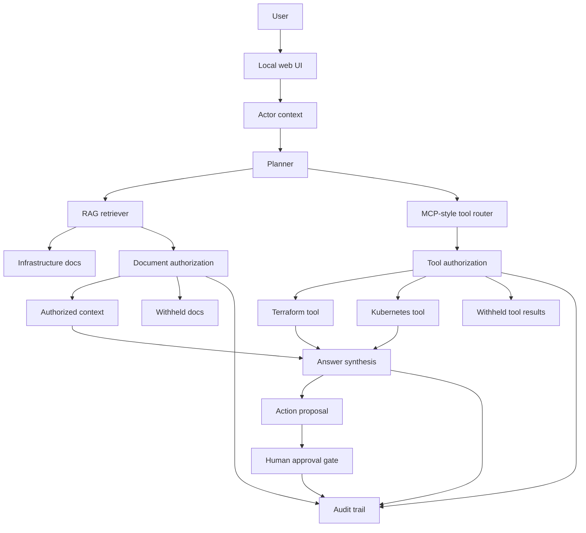

# Architecture Overview

This document keeps the deeper architecture explanation out of the README while preserving the full product story.

The core production pattern is:

> Terraform remains the infrastructure control point. AI can help explain, review, and propose, but HCP Terraform or Terraform Enterprise should remain the system of record for runs, plans, policy checks, approvals, variables, state, and audit.

## Product Scenario

A platform engineer asks:

> Check whether the payments service is healthy and whether there were recent Terraform changes.

The workflow:

1. Identifies the actor.
2. Retrieves only documents the actor can access.
3. Calls allowed Terraform and Kubernetes tools.
4. Withholds unauthorized docs and tool results.
5. Produces an answer from authorized context.
6. Logs every decision.

If the user asks:

> Apply the rollback to production.

The workflow does not execute directly. It creates a rollback proposal and requires approval from a user with the right permission.

In production, that proposal would hand off to a controlled Terraform workflow rather than becoming a parallel apply path.

## Demo Personas

| User | Role | Access |
| --- | --- | --- |
| Alice | Platform engineer | Platform docs, production docs, Terraform read, Kubernetes read, rollback planning |
| Bob | Support engineer | Public docs, support docs, customer impact docs, limited service status |
| Casey | Contractor | Public docs only |
| Dana | Platform lead | Alice's access plus remediation approval |

## Suggested Walkthrough

1. Select Alice.
2. Run: `Check whether the payments service is healthy and whether there were recent Terraform changes.`
3. Notice that Alice can see production docs and infrastructure tool results.
4. Switch to Bob and run the same prompt.
5. Notice that Bob sees support/customer context but not privileged Terraform data.
6. Switch to Casey and run the same prompt.
7. Notice that Casey receives only public context.
8. Select Alice and run: `Create a rollback proposal for the last Terraform change.`
9. Switch to Dana and approve the proposal.
10. Review the audit trail.

## Architecture

## Why MCP

MCP is useful because AI assistants increasingly need access to external systems, not just static prompts. In this demo, MCP-style tools expose infrastructure capabilities such as Terraform change inspection and Kubernetes service status.

The important design point is that MCP makes tool access explicit, but it does not make tool access automatically safe. The application still needs domain-level authorization around which actor can call which tool, against which resource, under which conditions.

For Terraform specifically, the public Terraform MCP Server is an example of a structured interface between AI assistants and Terraform Registry or HCP Terraform/TFE data. That interface still needs trust boundaries because Terraform data exposed to an MCP client may become visible to the model.

## Why RAG

Infrastructure answers depend on local, changing, organization-specific knowledge: runbooks, postmortems, Terraform procedures, customer impact notes, and service ownership data.

RAG grounds the assistant in that knowledge. But retrieval is also a security boundary. If unauthorized context is retrieved and sent to the model, the system has already leaked information.

This demo treats retrieved documents as protected resources.

## Why Approval Gates

Production infrastructure workflows often need plans, reviews, approvals, and audit trails. The assistant can summarize authorized context and propose next steps, but it should not directly mutate production just because a prompt asked it to.

The demo intentionally stops at approval recording. In a production version, approval would hand off to a controlled deployment or incident remediation workflow inside the Terraform control plane.

## Security Model

Protected resources:

- Documentation chunks.
- Terraform workspace data.
- Kubernetes service status.
- Rollback proposals.
- Approval authority.
- HCP Terraform/TFE run, workspace, and Stack context.

Policy principles:

- Filter context before model exposure.
- Check tools before execution.
- Log denied docs and tools without exposing their contents.
- Require human approval for production-impacting actions.
- Make the final answer explain what was used and what was withheld.
- Keep Terraform plans as the primary review surface for infrastructure change.

## What Would Change In Production

This demo uses local data and a simple in-browser permission map to keep the workflow understandable.

In production, I would add:

- Real authentication through OIDC.
- An external authorization service for relationship-based access decisions; SpiceDB/AuthZed is one example included in this repo.
- Real MCP servers, starting with read-only Terraform and Kubernetes integrations.
- `tfctl` for controlled HCP Terraform/TFE API workflows where a CLI interface is more appropriate than MCP.
- Vector or hybrid retrieval with chunk-level permissions.
- Persistent audit storage.
- OpenTelemetry traces for retrieval, tool calls, authorization decisions, and approvals.
- Red-team prompts and evals for prompt injection, data leakage, and unsafe tool use.
- Memory with retention, deletion, and authorization controls.

## What Is Intentionally Not Implemented

The project does not directly mutate production infrastructure.

That is intentional. The product stance is that tools retrieve authorized context, the agent explains and proposes, and production-impacting actions hand off to a controlled workflow with explicit approval and auditability.

## Current Status

This is still an exploration, not a production service. But it includes concrete paths for the gaps an infrastructure team would naturally ask about:

- Real embeddings: `src/build-embeddings.mjs`
- Optional external authorization provider example: `spicedb/schema.zed`
- Terraform MCP: `mcp/terraform-mcp.example.json`
- OIDC: `docs/oidc-authentication-plan.md`
- Production roadmap: `docs/production-milestones.md`

## Core Takeaway

AI-assisted infrastructure workflows are not just model problems. They are also authorization, context, tool-use, governance, and operational trust problems. Terraform remains the control point for infrastructure change.
