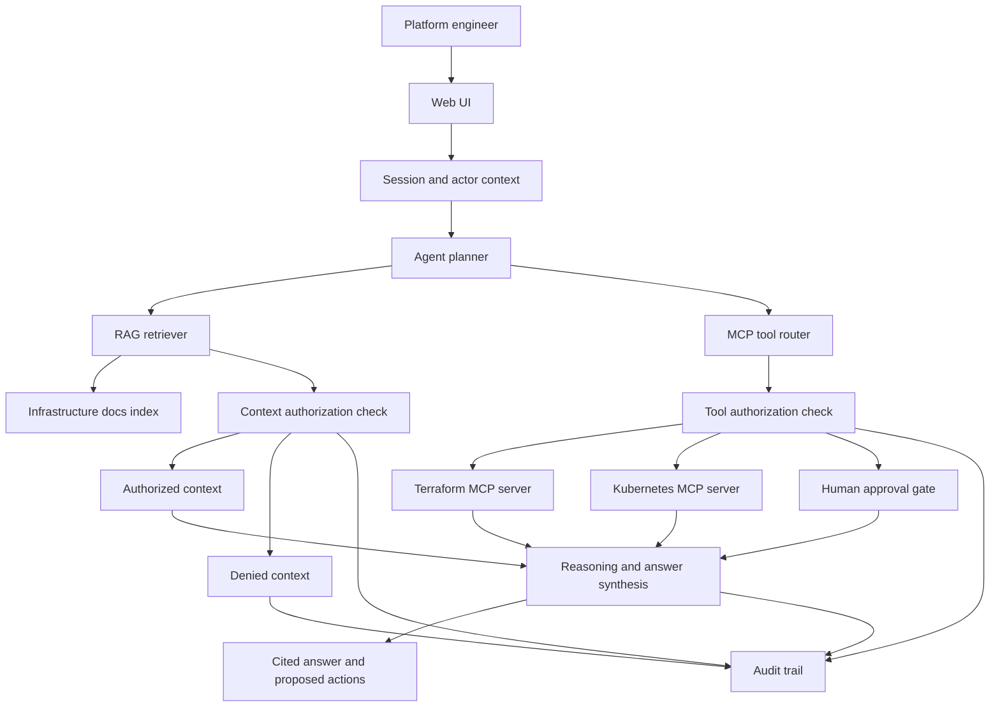

# AI-Native Infrastructure Copilot

Portfolio project brief for a Senior TPMM / DevRel candidate focused on AI infrastructure, platform engineering, developer workflows, and authorization.

## One-Sentence Pitch

An AI-native platform engineering assistant that answers infrastructure questions from trusted docs, inspects Terraform and Kubernetes context through MCP tools, proposes safe actions, and enforces authorization plus human approval before anything risky happens.

## Hiring Manager Signal

This project is designed to show that I understand AI-native developer workflows as production systems, not as chatbot demos.

It demonstrates:

- Practical use of MCP where tool integration matters.
- RAG grounded in infrastructure documentation.
- Clear separation between retrieval, reasoning, and action.
- Authorization and approval boundaries for agentic workflows.
- Explainability through citations, audit logs, and architectural decision records.
- Product thinking around what platform engineers would actually trust and use.

## Target Audience

- AuthZed: authorization for AI agents, RAG, and MCP tools.
- Linear: AI-native workflows that respect user context, permissions, and team operations.
- Sanity: structured content, retrieval, editorial control, and AI-assisted developer experiences.
- Alien and similar AI infrastructure companies: operationally thoughtful agent workflows.
- DevRel / TPMM hiring managers: ability to turn emerging infrastructure concepts into clear demos, content, and technical narratives.

## Core User Story

A platform engineer asks:

> What changed in production, what runbooks apply, and should we roll anything back?

The assistant:

1. Identifies the actor and their permissions.
2. Retrieves only authorized runbooks, incident notes, and architecture docs.
3. Uses MCP tools to inspect Terraform and Kubernetes context.
4. Separates facts from proposed actions.
5. Requires human approval before destructive or production-impacting actions.
6. Emits an audit trail explaining what context was retrieved, which tools were called, which actions were denied or approved, and why.

## MVP Scope

The MVP should be impressive because it is clear, not because it is large.

### Included

- Local web UI.
- Small realistic infrastructure document corpus.
- Permission-aware RAG.
- One or two MCP-style tool servers.
- Agent workflow with read-only inspection and proposed actions.
- Authorization layer for retrieval and tool calls.
- Human approval gate for risky actions.
- Audit log.
- README, architecture diagram, demo script, sample prompts, blog outline, and future enhancements.

### Excluded From MVP

- Real cloud credentials.
- Real production mutations.
- Complex multi-agent orchestration.
- Overly broad framework experimentation.
- Authentication beyond a simple local user selector.

## Architecture

## Architectural Decisions

### Why MCP?

MCP is useful here because platform engineering assistants need to interact with external systems, not just summarize static text.

In this project, MCP gives the assistant a structured way to access infrastructure capabilities such as Terraform workspace inspection, Kubernetes service status, and runbook lookup. This is better than hiding tool access inside application-specific glue code because MCP makes tools explicit, inspectable, and easier to reason about.

The tradeoff is that MCP expands the blast radius of an AI workflow. Once an assistant can use tools, the project must address tool authorization, approval, and auditability.

### Why RAG?

RAG is useful because infrastructure answers should be grounded in current internal knowledge: runbooks, incident notes, architecture docs, Terraform conventions, and service ownership metadata.

The project should not rely on the model to invent operational facts. It should retrieve source material, cite it, and show which context was used.

The tradeoff is that retrieval becomes a security boundary. If unauthorized documents are retrieved and sent to the model, the system has already leaked context even if the final answer looks harmless.

### Why Authorization?

Authorization is the central product insight.

AI systems introduce new access paths:

- A user can indirectly access documents through RAG.
- An agent can indirectly access tools through MCP.
- A workflow can indirectly perform actions through delegated authority.
- Memory can preserve sensitive context across sessions.

This project treats authorization as a first-class control plane rather than a post-processing filter.

### Why Human Approval?

Infrastructure workflows often involve high-consequence actions. The assistant should be allowed to inspect, explain, and propose by default, but production-impacting changes should require explicit approval.

This reflects how platform teams already think about change management: dry runs, plans, peer review, approvals, audit logs, and rollback paths.

### Why Start Local?

The project should be easy for a hiring manager to run and understand.

A local-first version avoids cloud account setup and credential risk while still demonstrating the architecture. Real Terraform Cloud, Kubernetes, and identity provider integrations can be documented as production extensions.

## Security Model

### Actor Context

Each request has an actor:

- `alice`: platform engineer with production read access.
- `bob`: support engineer with customer-facing incident access.
- `casey`: contractor with public/internal-general access only.
- `dana`: platform lead with approval authority.

### Protected Resources

- Documentation chunks.
- Terraform workspaces.
- Kubernetes namespaces.
- Proposed actions.
- Stored memory.

### Permission Examples

- `doc.read.public`
- `doc.read.platform`
- `doc.read.customer`
- `terraform.workspace.read.dev`
- `terraform.workspace.read.prod`
- `terraform.plan.create`
- `terraform.apply.prod`
- `kubernetes.service.read.prod`
- `incident.remediation.approve`

### Policy Principles

- Retrieve only authorized context.
- Tool calls require authorization before execution.
- Production mutations require approval even if the user has broad access.
- Denied context and denied tools should appear in the audit log, not in the model context.
- The assistant should explain what it used and what it could not access.

## Technical Implementation Options

### Simple MVP Stack

- Frontend: static HTML or Next.js.
- Backend: TypeScript with Express or Python with FastAPI.
- RAG: local JSON corpus plus keyword search first, then embeddings later.
- MCP: lightweight local MCP servers or MCP-shaped tool adapters.
- Authorization: local relationship map first, SpiceDB/AuthZed later.
- Audit: structured JSON event log.

### Production-Shaped Stack

- Frontend: Next.js.
- Backend: TypeScript.
- Agent orchestration: OpenAI Agents SDK, LangGraph, or a small custom state machine.
- RAG: Postgres + pgvector or OpenSearch hybrid retrieval.
- MCP: official Terraform MCP server plus custom Kubernetes/runbook MCP server.
- Authorization: SpiceDB/AuthZed.
- AuthN: OIDC.
- Observability: OpenTelemetry traces.

## Demo Flow

### Scene 1: Same Question, Different User

Prompt:

> What do we know about the production outage?

Expected behavior:

- Alice sees platform postmortem and production rollback context.
- Bob sees customer-facing support context.
- Casey sees only public incident response process.

Point:

RAG is not just retrieval. It is permission-aware context assembly.

### Scene 2: MCP Tool Access

Prompt:

> Check whether the payments service is healthy and whether there were recent Terraform changes.

Expected behavior:

- The assistant calls read-only Kubernetes and Terraform tools.
- Tool calls are shown in the audit log.
- Unauthorized tools are denied before execution.

Point:

MCP makes tool use explicit, but authorization decides which tools are safe for each actor.

### Scene 3: Risky Action Requires Approval

Prompt:

> Roll back the production Terraform change.

Expected behavior:

- The assistant refuses to execute directly.
- It generates a rollback proposal.
- It requires approval from a user with `incident.remediation.approve`.

Point:

Agents should propose high-risk actions before taking them.

### Scene 4: Explainability

Prompt:

> Why did you recommend that?

Expected behavior:

- The assistant cites retrieved docs.
- It lists tool outputs used.
- It shows authorization and approval decisions.

Point:

Trust comes from traceability, not just fluent answers.

## Sample Prompts

- What changed in production today?
- What runbook applies to elevated API latency?
- What customer-facing message should support use?
- Does Alice have enough access to inspect the production workspace?
- Can Bob see the production postmortem?
- Check the payments service status.
- Create a rollback proposal for the last Terraform change.
- Apply the rollback.
- Why was that action denied?
- What context did you use to answer?

## README Outline

1. Project title and one-sentence pitch.
2. Problem statement.
3. Why infrastructure teams need this.
4. Architecture diagram.
5. Demo walkthrough.
6. Local setup.
7. Sample users and permissions.
8. How RAG works.
9. How MCP tools work.
10. How authorization works.
11. Human approval model.
12. Audit log examples.
13. Security considerations.
14. What would change in production.
15. Future roadmap.

## Blog Outline

Title:

> AI Agents Need an Authorization Layer, Not Just Better Prompts

Sections:

1. The shift from chatbots to tool-using systems.
2. Why infrastructure assistants are high-stakes.
3. RAG creates a new context access problem.
4. MCP creates a new tool access problem.
5. Agents create a delegated authority problem.
6. Memory creates a durable context governance problem.
7. A practical architecture for permission-aware AI workflows.
8. What I built.
9. What I would change in production.
10. What this means for platform engineering teams.

## Future Enhancements

- Replace local permissions with SpiceDB/AuthZed.
- Add the official Terraform MCP server in read-only mode.
- Add a custom Kubernetes MCP server.
- Add OIDC authentication.
- Add persistent memory with retention and deletion controls.
- Add OpenTelemetry traces for retrieval, reasoning, tool calls, and policy checks.
- Add GitHub PR workflow for Terraform plan review.
- Add red-team prompts and evaluation cases.
- Add a short recorded walkthrough.

## Interview Talking Points

### Why did you choose MCP instead of direct API calls?

Because MCP makes tool access explicit and portable. For AI-native developer workflows, the assistant should be able to discover and call tools through well-defined interfaces. But MCP does not remove the need for domain-level authorization; it makes that need more visible.

### Why use RAG here?

Infrastructure answers depend on local, changing, organization-specific knowledge. RAG grounds the assistant in runbooks, incidents, architecture docs, and Terraform conventions instead of relying on generic model knowledge.

### How did you think about security?

I treated retrieved context, tool calls, proposed actions, and memory as protected resources. The model only sees context the actor is allowed to access. Tools are authorized before execution. Risky actions require approval. Every decision is auditable.

### What would you change in production?

I would add real identity, SpiceDB/AuthZed-backed authorization, OIDC, OpenTelemetry, persistent audit storage, rate limits, secrets isolation, evals, and staged rollout controls. I would also keep destructive actions behind human approval until the system had strong operational maturity.

