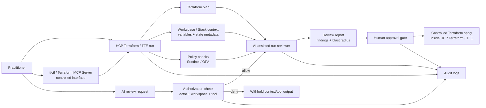

# Video Architecture Diagram

Use this diagram for:

- the first video
- blog post
- README excerpt
- conference/demo slide

## AI-Assisted Terraform Run Review Workflow



## Talk Track

HCP Terraform or Terraform Enterprise remains the production control plane for runs, plans, policy checks, approvals, variables, state, and audit logs. Interfaces such as `tfctl` and the Terraform MCP Server provide controlled access paths into Terraform workflows. The assistant reviews run context and explains risk, but it does not apply. Authorization controls who can inspect context or call tools. Policy controls whether the Terraform change is acceptable. Human approval controls whether anything proceeds.

## Short Version

```text
HCP Terraform / TFE run
  -> plan + policy + context
  -> controlled access through tfctl / Terraform MCP
  -> authorized AI review
  -> blast-radius report
  -> human approval
  -> controlled apply in Terraform
```
