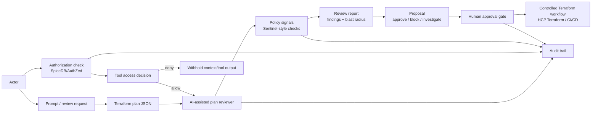

# Video Architecture Diagram

Use this diagram for:

- the first video
- blog post
- README excerpt
- conference/demo slide

## AI-Assisted Terraform Review Workflow



## Talk Track

Terraform remains the source of proposed infrastructure change. The assistant reviews the plan and explains risk, but it does not apply. Authorization controls who can inspect context or call tools. Policy controls whether the change is acceptable. Human approval controls whether anything proceeds to a controlled Terraform workflow.

## Short Version

```text
Terraform plan
  -> authorized AI review
  -> policy findings
  -> blast-radius report
  -> human approval
  -> controlled apply
```

