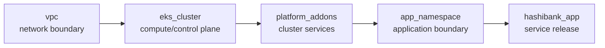

# HashiBank-Style Stack Component Graph

This local graph mirrors the shape of the richer HashiBank Stacks companion without requiring AWS, Kubernetes, Helm, or HCP Terraform access for the default demo path.

## Component Responsibilities

| Component | Owns | Outputs |
| --- | --- | --- |
| `vpc` | network CIDR, AZ count, subnet model | `vpc_id`, subnet IDs |
| `eks_cluster` | cluster model and node count | `cluster_name`, `cluster_endpoint` |
| `platform_addons` | cluster add-ons | `addon_set_name`, enabled add-ons |
| `app_namespace` | namespace and service account boundary | `namespace`, `service_account` |
| `hashibank_app` | app release shape | `service_name`, `app_url`, release summary |

## Why This Matters

In the old workspace model, these dependencies exist but are spread across workspace outputs, remote state, variables, CI jobs, and runbooks.

In the Stack model, the dependency graph is explicit. That gives an AI reviewer better context for questions like:

- Does this app change depend on a namespace or add-on change?
- Is this isolated to the application component?
- Would a cluster or network change widen the blast radius?
- Should this deployment be auto-approved in dev but manually approved in prod?

## Demo Boundary

The assistant can explain this graph and summarize blast radius. It should not apply Stack changes.
